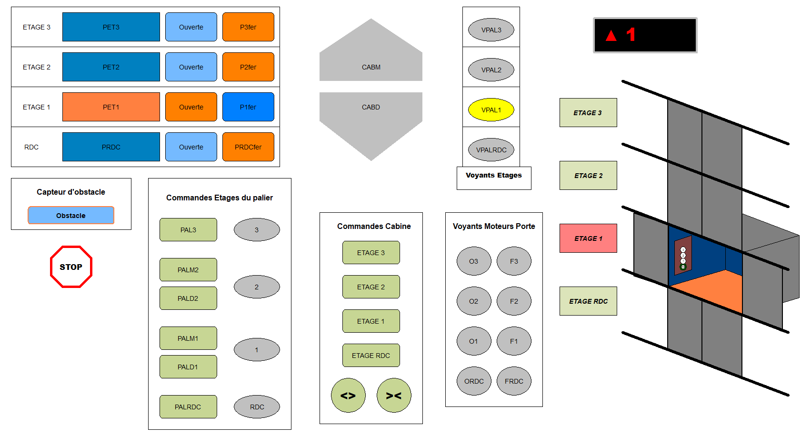
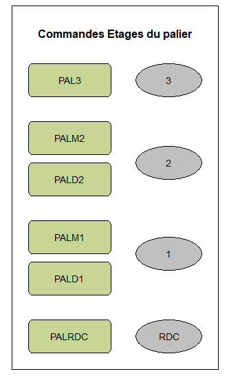
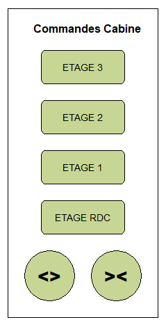
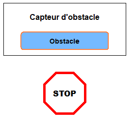
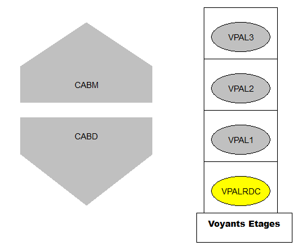
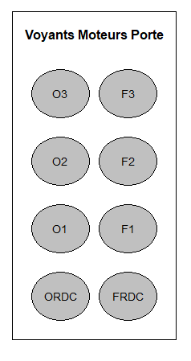
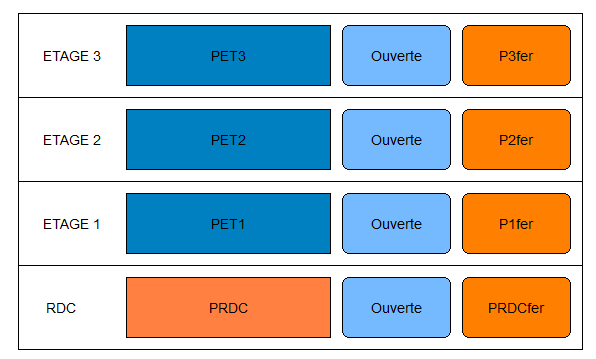
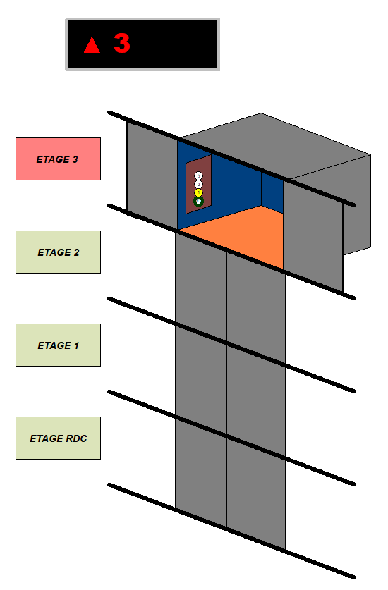

# Elevator Simulation - CoDeSys

This project is a french project realised with [CoDeSys v2.3](https://store.codesys.com/en/codesys-development-system-v2-3.html) a free trial software to learn low-level autonomous system automation and programation. 

---

## Features (Updated 03/2020)
- [x] Visualisation and self-made simulation engine (low-level)
- [x] Virtual Sensors/Motors automation linked to the simulation
- [x] Floor priority algorithm managment
- [ ] English comments in the code

## Start the simulation

Their is few steps before starting to use the program. The simulation has to be initiated.
 - Go to :Online > login 
 - Then Go to : Online > Run

## 1. Command Pannels
Their is 2 main command pannel in the project which consit of button that can be activated like in a real elevator.

### 1.1. Floor Commands
The first command pannel represent the buttons located on each floor. 
Like in a real elevator, the user has to specify if he want to go up or down.
This process allow to make the floor priority selection smoother.
On the right, a flashing yellow light indiactes that the call has been received by the elevator.

### 1.2. Cabin Commands
The second command pannel represent the buttons located inside the elevator cabin. 
The cabin will follow the direction chosen or take one if no previous instructions were given.

### 1.2. Emergency Commands
The last panel is the emergency commands.
The stop button is just an emergency stop.
The obstacle button is a toggle button that simulate an obstacle. 
While the button is orange, an obstacle is force detected by the door sensor.

## 3. Feedback Pannels
### 2.1. Motors

The feedback pannels represent the indicators visible to understand what the simulation is doing.
The motor indicator flash yellow during use. Their is motors for the cabin and motors for the doors.

### 2.2. Sensors

Their is a last panel for the sensors at each floor. The cabin detection sensor and the door limit switch.
Once a sensor is orange that means the sensor is toggled.

## 3. The simulation
The visual simulation is not only a representation of what the motor are doing but also an actuator for the sensors defined graphically in pixel.
Each sensor is virtually located at a pixel range location to toggle the door sensors and cabin position sensors.
The cabin automaticaaly reset after a defined sleep time and goes back to the ground floor.
A black and red screen, display the next destination and always show the best next floor is the path is optimised during a call. This display also indidacted what is the direction of the elevator.

